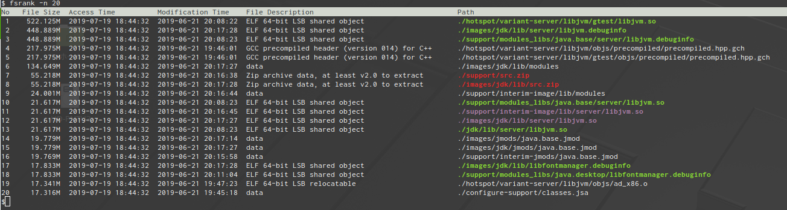
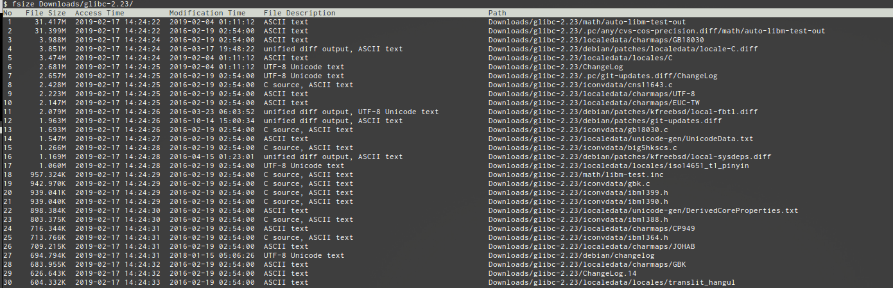

# fsize - command for showing the list of large files in directory with details.
- Show the list of large files in the specified directory with details, such as modified time, accessed time, file description.
- Files are sorted by file size in descending order.

## Features 
- File paths are colored in accordance with LS_COLORS
- File type is described by using libmagic

## Usage
```
$ ./fsize [-r] [-n num] [directory]
```

## Example
- Without specifying directory, fsize analyze current directory.
- Path names are colored depending on the file types.


- You can specify directory which is to be analyzed.


